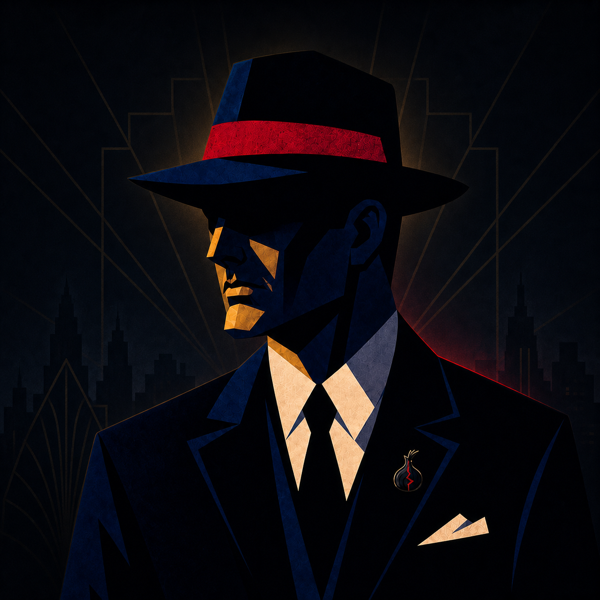
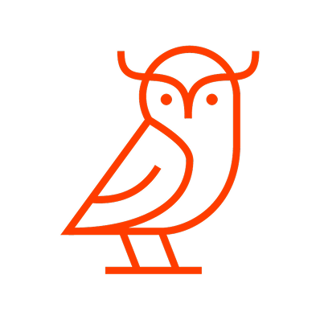

# K0NGR3SS

**Penetration Testing & Threat Hunting · Cloud & Infrastructure Security · Security Engineering & Monitoring**

**Professional links**

**Security platforms**

---

## About me

I'm a Cybercrime and IT Security student at SETU Carlow. I focus on web and cloud security, threat hunting, security tooling, and bug bounty work.

- **🇮🇪Team Ireland member and candidate for ECSC 2026** in Bochum, Germany.
- Qualified for the **WorldSkills Ireland 2026 Cyber Security competition**, taking place in Dublin on 16–18 September 2026.
- Improving my bug-bounty workflow and continuing to develop WAFPierce, which has grown into my daily-use WAF testing tool.

I also really like Art Deco—probably more than a cybersecurity portfolio strictly requires.

## CTFs, competitions & community

- **EU-CONEXUS ENABLES Hackathon 2026** — helped build Agribloom and placed **2nd**, contributing application features, database integration, and deployment security.
- **WorldSkills Ireland 2026 Qualifier** — successfully qualified for the Cyber Security main event in September 2026.
- **SAS CTF 2026** — competed with **Ireland Without the RE** and finished **127th of 512 teams**.
- **ZeroDays CTF 2026** — Team Captain; finished **5th of 71 college teams** and **18th of 141 overall**, solving Web, Crypto, and Pwn challenges.

---

## Skills

### Offensive Security

Web and cloud penetration testing | Threat hunting | Reconnaissance | Cryptography | SQL injection | XSS | SSTI | SSRF | Path traversal | IDOR | Broken access control | JWT security testing

### Programming Languages

Python | Bash | Go | JavaScript (React) | C | x86/x64 Assembly

### Cloud & Infrastructure

AWS | GCP | Docker | GitHub Actions | Terraform and Infrastructure as Code | CI/CD security | IAM and least privilege | Network segmentation | Secrets management

### Analysis & Monitoring

Log analysis and correlation | Threat detection | Incident triage | Network traffic analysis | Vulnerability assessment | System hardening | Technical reporting

---

## GitHub activity

  
  

  

  

